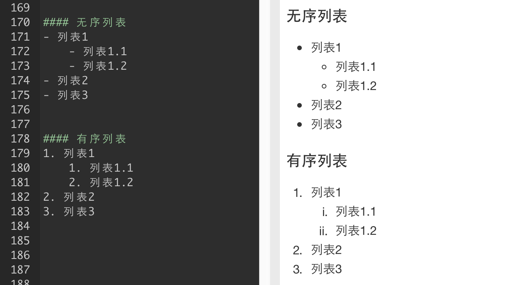
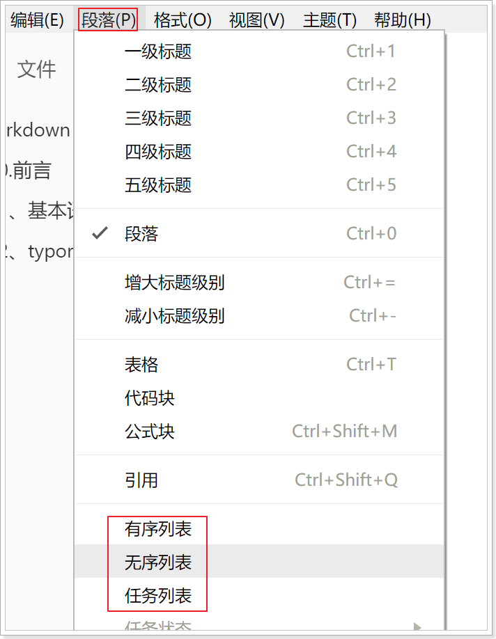
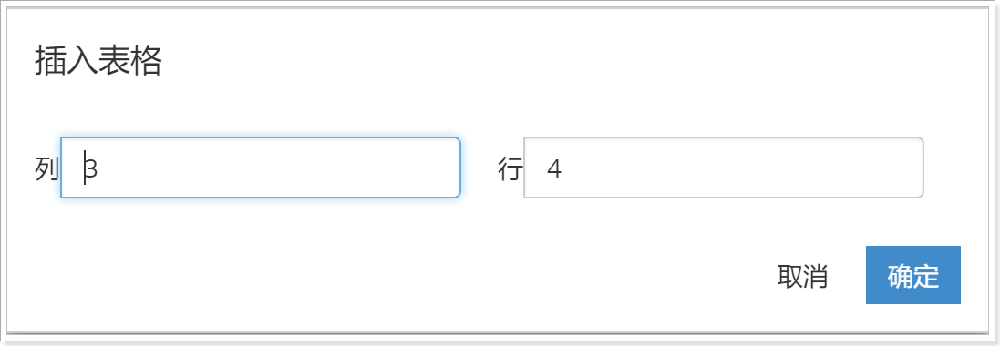
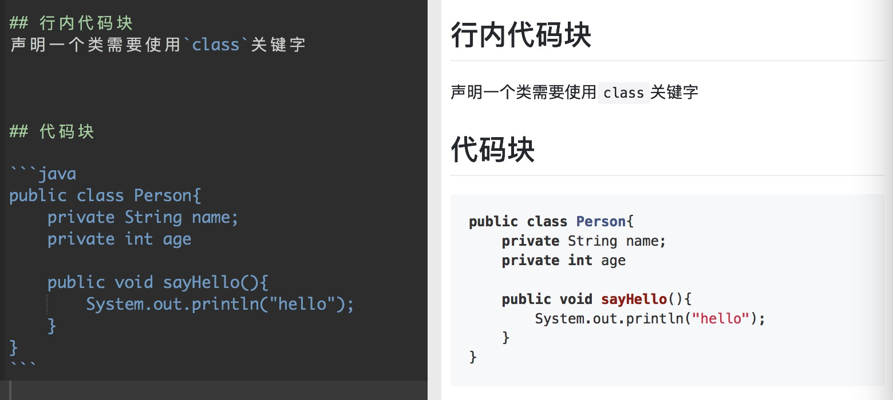

# Markdown 简洁语法说明

## 0.前言

一直以来都是以word文档做笔记，存在很多问题，比如代码格式、高亮等。这次公司要求使用markdown，感觉眼前一亮，以前word的问题都得到了解决，而且可以生成电子书，或者直接通过gitbook放到网络中，非常棒。

但是很多的同事可能与我一样，之前对markdown并不熟悉，所以对语法、typora的快捷键都不太熟悉，因此就有了本文。

## 1、基本语法

### 1.1 多级标题

#### 语法

在Markdown中，如果想将一段文字定义为标题，只需要在这段文字前面加上 `#`，**再在 `#` 后加一个空格**即可。还可增加二、三、四、五、六级标题，总共六级。每多一级 ，增加一个 `#` ，标题字号相应降低一级。如图：


#### 快捷键

在typora中，1级标题对应的快捷键是：`CTRL + 1` ，其它级别分别对应2~6的数字即可


### 1.2 列表

#### 语法说明

列表格式也很常用，它可以让你的文稿变得井井有条。在 Markdown 中，你只需要在文字前面加上 `-` 就可以了；如果你希望是有序列表，在文字前面加上 `1. 或2. 或3.` 即可。

注意：无论是`-` 还是 `1.`都需要在后面跟上一个空格




#### 快捷键

typora中并没有对应快捷键，不过在菜单中有对应选项：




### 1.3 引用

#### 语法说明

如果你需要在文稿中引用一段别处的句子，那么就要用到「引用」格式。

在引用文字前加上 `>` 并与文字保留一个字符的空格即可。如图：


#### 快捷键

typora中的快捷键是：`CTRL+SHIFT+Q`


### 1.4 粗体和斜体

#### 语法说明

Markdown 的粗体和斜体也非常简单：

用两个 `*` 包含一段文本就是粗体的语法；

用一个 `*` 包含一段文本就是斜体的语法。

如图：


#### 快捷键

typora中的快捷键：

​	粗体：`Ctrl + B`

​	斜体：`Ctrl + I`

​	下划线：`Ctrl + U`


### 1.5 链接

#### 语法说明

在 Markdown 中，插入链接的语法如下：

```markdown
[链接文本](链接地址)
```
#### 快捷键

typora中的快捷键是：`Ctrl + K`


### 1.6 图片

#### 语法说明

在 Markdown 中，插入图片的语法如下：

```markdown

```

#### 快捷键

typora中的快捷键是：`Ctrl + Shift + I`


### 1.7 分割线

分割线的语法只需要另起一行，连续输入三个星号 *** 即可分割两段文字内容。


### 1.8 表格

表格输入相对复杂，推荐使用工具自带功能实现

#### 语法说明


#### 快捷键

typora的快捷键：`Ctrl + T`

弹出菜单：



生成的表格：


### 1.9 代码高亮

#### 语法说明

行内代码块：

```markdow
`代码`
```

段落代码块：

```markdwon
​```语言类型
代码
​```
```


示例：




#### 快捷键

行内代码：

```markdown
Ctrl + Shift + `
```

# 链接、跳转示例

## 示例1

**锚点：**


```csharp
[跳转到个人简介](#个人简介)
```

**锚点目标：**


```bash
# 个人简介
```

## 示例2

**锚点：**


```csharp
[跳转到个人简介]: #个人简介
[跳转到个人简介][]
```

**锚点目标：**


```undefined
个人简介
=====
```

## 示例3

**锚点：**


```csharp
[跳转到个人简介](#个人简介)
```

**锚点目标：**


```xml
<p id="个人简介">这是个人简介</p>
```

## 示例4

**锚点：**


```csharp
[跳转到个人简介](#个人简介)
```

**锚点目标：**


```xml
<a name="个人简介">这是个人简介</a>
```

## 示例5

**锚点：**


```xml
<a href="#个人简介">跳转到个人简介</a>
```

**锚点目标：**


```undefined
个人简介
----
```

## 示例6

**锚点：**


```xml
<a href="#个人简介">跳转到个人简介</a>
```

**锚点目标：**


```xml
<h1 id="个人简介">这是个人简介</h1>
```

## 示例7

**锚点：**


```xml
<a href="#个人简介">跳转到个人简介</a>
```

**锚点目标：**


```xml
<a name="个人简介">这是个人简介</a>
```